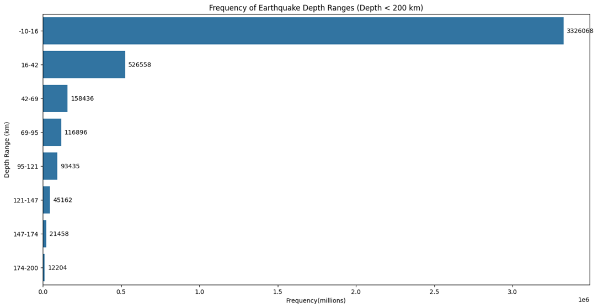

# USGS Global Earthquake Exploratory Data Analysis (1900-2025) 

  
  
  
  
  
  
  
  
  

 

 
## 🌍 Project Overview

This project presents an in-depth Exploratory Data Analysis (EDA) of global earthquake activity from 1900 to 2025, using data sourced from the United States Geological Survey (USGS). The goal of this analysis is to uncover long-term seismic trends, geographical distributions, magnitude characteristics, and temporal patterns of earthquakes worldwide. Through Python-based visualization and geospatial analysis, this project aims to provide insights into the frequency, strength, and spatial behavior of earthquakes over the last 125 years, helping to better understand Earth’s seismic activity patterns. 

## 🗂️ Dataset 

While several region-specific earthquake datasets exist — such as the [Turkish Earthquake Dataset (1914–2023)](https://www.kaggle.com/datasets/ozgecinko/turkey-earthquake-data-1914-2023) , the [Italian INGV Dataset](https://www.pi.ingv.it/banche-dati/instance/) , and the [Stanford Earthquake Dataset](https://www.pi.ingv.it/banche-dati/instance/) ; the [USGS Global Dataset](https://www.kaggle.com/datasets/bwandowando/earthquakes-around-the-world-from-1900-2025/data) stands out as the most suitable foundation for a comprehensive, long-term, and comparative exploratory analysis. 

| **Aspect**              | **USGS Global Dataset**    | **Turkish Dataset**    | **Italian Dataset**     | **Stanford Dataset** |
| ----------------------- | -------------------------- | ---------------------- | ----------------------- | -------------------- |
| **Geographic Scope**    | Worldwide                  | Turkey only            | Italy only              | Regionally limited   |
| **Time Range**          | 1900–2025                  | 1914–2023              | 1985–present            | Varies               |
| **Data Source**         | USGS (authoritative)       | Kandilli Observatory   | INGV (Italy)            | Academic collection  |
| **Standardization**     | High (consistent schema)   | Moderate               | Moderate                | Varies               |
| **Best For**            | Global & comparative EDA   | Regional seismic focus | Regional hazard studies | Specialized research |
| **Chosen For Project?** | **Yes**                    | No                     | No                      | No                   | 

The [USGS Global Dataset](https://www.kaggle.com/datasets/bwandowando/earthquakes-around-the-world-from-1900-2025/data) provides the broadest, most consistent, and longest publicly available record of seismic activity. Its extensive temporal coverage (1900–2025) and standardized global reporting make it ideal for uncovering long-term trends and global-scale earthquake behavior. This enables richer insights across both time and geography, supporting research-grade EDA and global visualization. Summary of important columns of this dataset is given below. 

| **Column Name** | **Data Type**         | **Description**                                                                                             | **Example Value**     |
| --------------- | --------------------- | ----------------------------------------------------------------------------------------------------------- | --------------------- |
| `DateTime`      | `datetime`            | Timestamp of the earthquake occurrence in UTC. Enables time-series and trend analysis.                      | `2023-02-06 01:17:35` |
| `Latitude`      | `float`               | Geographic coordinate specifying the north–south position of the epicenter (in decimal degrees).            | `38.021`              |
| `Longitude`     | `float`               | Geographic coordinate specifying the east–west position of the epicenter (in decimal degrees).              | `37.204`              |
| `Depth`         | `float`               | Depth of the earthquake’s focus in kilometers below the surface. Helps analyze shallow vs deep earthquakes. | `10.0`                |
| `Magnitude`     | `float`               | Earthquake’s magnitude (Richter, Mw, or Ms), indicating energy released. Used for intensity classification. | `7.8`                 |
| `Type`          | `string`              | Type or classification of seismic event (e.g., Earthquake, Quarry Blast, Nuclear Explosion, Induced Event). | `Earthquake`          |
| `Location`      | `string`              | Nearest known place or region name describing where the earthquake occurred.                                | `Southern Turkey`     |
| `Country`       | `string`              | Country name derived from geographic coordinates or location metadata.                                      | `Turkey`              |
| `Source`        | `string`              | Data provider or recording agency (typically USGS).                                                         | `USGS`                |
| `Status`        | `string`              | Event verification status (indicates whether the event was reviewed or automatic)                           | `reviewed`            | 

Some columns have significant amount of missing values. These are visualized in the following bar chart. 

 

## 🎯 Objectives 

The objective of this project is to analyze over 125 years of global earthquake data to uncover spatial, temporal, and geological patterns that define seismic behavior across the world. The following table outlines the key research questions and their analytical significance: 

| 🔍 **Research Question**                                                                                                            | 🌎 **Significance / Analytical Goal**                                                                                           |
| ----------------------------------------------------------------------------------------------------------------------------------- | ------------------------------------------------------------------------------------------------------------------------------- |
| **🌍 Which regions and countries experience the most earthquakes?**                                                                 | Identifies global earthquake hotspots and tectonically active zones to understand regional seismic risk.                        |
| **🕰️ How has earthquake frequency changed over time?**                                                                             | Analyzes temporal trends to detect whether earthquake activity has increased, decreased, or remained stable over decades.       |
| **📏 At what depths do earthquakes occur most frequently, and are low-magnitude earthquakes more common than high-magnitude ones?** | Explores the depth and strength distribution of earthquakes to understand crustal stress behavior and common earthquake types.  |
| **⚠️ Which range of earthquake magnitudes occurs most often?**                                                                      | Determines the most frequent magnitude range to assess the global scale of seismic energy release.                              |
| **🧩 Is there a relation between earthquake depth and magnitude?**                                                                  | Evaluates correlations between how deep an earthquake originates and its intensity, providing insight into subsurface dynamics. |
| **🌋 What are the ten most powerful earthquakes that have occurred on Earth over the past 125 years?**                              | Highlights extreme seismic events, offering historical context and emphasizing global impact zones.                             |

The questions are addressed in the following section, which includes visual illustrations to support the explanations. Python codes and outputs used in this EDA are available in the [Link](https://github.com/ShaikhBorhanUddin/USGS-Global-Earthquake-Exploratory-Data-Analysis-1900-2025/blob/main/Notebooks/USGS_earthquake_EDA.ipynb) .

## 📊 Key Exploratory Analyses 

🌍 **Which regions and countries experience the most earthquakes?** 

  
  

 

The global earthquake distribution analysis from 1900 to 2025 reveals that seismic activity is highly concentrated along major tectonic plate boundaries, especially within the Pacific Ring of Fire. North America recorded the highest number of earthquakes, largely due to the high-frequency events in Alaska, the western United States, and along the Rocky Mountain region. Significant seismic clusters were also observed across the Andes Mountains in South America, the coastal regions of Japan, the South China Sea, the Indochinese Peninsula, and parts of Central and Southern Europe; all of which lie near active plate boundaries. Oceanic zones such as the Bismarck Sea, Philippine Sea, and other subduction zones around the Pacific were particularly active, highlighting the strong relationship between tectonic interactions and earthquake frequency. In contrast, vast inland regions like mainland Canada, Brazil, central Russia, and much of Africa exhibited relatively low seismic activity, while Antarctica remained the least affected continent. Although the **`place`** column in the dataset contains detailed location descriptors (e.g., “Yakutat Bay, Alaska” or “Bismarck Sea”), extracting specific country-level information from over four million records would require extensive geocoding computations. Therefore, this analysis emphasizes continental and regional patterns rather than individual country counts. 

🕰️ **How has earthquake frequency changed over time?** 

  
  
  

  

The frequency of earthquakes has changed dramatically over the past century. From 1900 to about 1970, the recorded number of earthquakes was very low, largely because of limited global coverage and the lack of advanced seismic monitoring equipment. As technology improved and seismic networks expanded worldwide after the 1970s, there was a noticeable and steady increase in the number of recorded earthquakes. This upward trend continued into the 2000s, reaching its peak around 2015–2020, before showing a slight decline in recent years. The 5-year rolling average graph clearly illustrates this overall long-term growth and helps smooth out short-term fluctuations, confirming that the apparent surge is part of a consistent trend rather than random variation. The monthly frequency analysis also reveals seasonal differences, with July experiencing the highest number of earthquakes and February the lowest, although such variations are relatively modest compared to the broader upward trend over the decades. Overall, the data suggests that the observed increase in earthquake frequency is largely due to improved detection and reporting capabilities rather than a sudden rise in global seismic activity. 

📏 **At what depths do earthquakes occur most frequently, and are low-magnitude earthquakes more common than high-magnitude ones?** 

  
  

 

The graphs show that earthquakes occur most frequently at very shallow depths, especially in the −10 to 16 km range. The presence of negative depth values indicates that many of these events happen extremely close to the Earth’s surface, sometimes even slightly above the reference level used for measuring depth. As depth increases, the frequency of earthquakes declines sharply, showing that deep earthquakes are much less common. Similarly, for magnitudes, the highest number of earthquakes occurs within the 0–2 magnitude range, but this also includes many events with slightly negative magnitudes. These negative-magnitude earthquakes are extremely small, often only detectable by instruments. The frequency drops steadily as the magnitude increases, with large earthquakes (above magnitude 6) being very rare. Overall, the data reveal that the most common earthquakes are both shallow (often near or just above the reference surface) and of very low magnitude, meaning that most seismic activity worldwide consists of tiny, surface-level tremors. 

⚠️ **Which range of earthquake magnitudes occurs most often?** 

 

The graph shows that minor earthquakes, those with magnitudes below 4, occur far more frequently than any other category. They make up the vast majority of recorded seismic events, with over 3.7 million occurrences. In contrast, light earthquakes (magnitude 4–5) are much less common, and the frequency continues to decline sharply for moderate (5–6), strong (6–7), and major (7+) earthquakes. This pattern highlights that small, low-magnitude earthquakes dominate global seismic activity, while large, destructive ones are relatively rare. 

🧩 **Is there a relation between earthquake depth and magnitude?** 

 

Both scatterplots show that earthquake depth does not have a strong or consistent relationship with magnitude. In both the original (left) and adjusted (right) plots, data points are widely dispersed across all depths and magnitudes, without a clear linear or curvilinear trend. Most earthquakes cluster around moderate magnitudes (3–6) and shallow to intermediate depths (0–200 km), while deeper quakes occur across a similar magnitude range. Even after setting negative magnitudes to zero in the adjusted graph, the overall distribution remains largely unchanged; indicating that while large earthquakes can occur at various depths, magnitude and depth appear largely independent in this dataset.

🌋 **What are the ten most powerful earthquakes that have occurred on Earth over the past 125 years?** 

  
  

 

The maps illustrate global earthquake locations and their corresponding magnitudes and times of the strongest earthquakes ever recorded last 125 years. The most powerful event documented is the **1960 Great Chilean (Valdivia) Earthquake**, which reached a magnitude of **9.5**, followed by the **1964 Prince William Sound Earthquake** in Alaska at **9.2**. Other significant quakes include the 2004 Sumatra–Andaman Islands and the 2011 Great Tohoku earthquakes, both measuring 9.1 in magnitude. The list also mentions a projected event, the 2025 Kamchatka Peninsula earthquake in Russia, estimated at a magnitude of 8.8. 

## ⚠️ Limitations

This exploratory data analysis provides meaningful insights into global earthquake behavior, but several limitations should be acknowledged. Approximately 164,000 entries in the dataset have missing values in the magnitude (mag) column, which may slightly distort magnitude-based summaries and statistical distributions. The dataset contains over 4.3 million earthquake records, making it computationally intensive to extract precise country information from latitude and longitude coordinates; as a result, country-level visualizations were not generated. In addition, earthquake data prior to the 1970s is sparse and inconsistently reported, which can lead to misleading interpretations when examining long-term temporal trends. Some entries also have limited precision in their coordinate data, reducing spatial accuracy during global mapping. The massive dataset size demands significant memory and processing resources, restricting the ability to perform advanced spatial or interactive analyses in standard environments. Finally, variations in measurement systems for magnitude and depth across different reporting periods may introduce minor inconsistencies when comparing global seismic activity over the full 125-year timeline. 

## 🧾 Licence

This project is licensed under the MIT License — a permissive open-source license that allows reuse, modification, and distribution with attribution. You are free to use, copy, modify, merge, publish, distribute, sublicense, and/or sell copies of the project, provided that the original copyright and license notice are included in all copies or substantial portions of the software.

For more details, refer to the [Licence](https://github.com/ShaikhBorhanUddin/USGS-Global-Earthquake-Exploratory-Data-Analysis-1900-2025/blob/main/LICENSE) file in this repository.

## 🤝 Contact

If you have any questions or would like to connect, feel free to reach out!

**Shaikh Borhan Uddin**  
📧 Email: [`shaikhborhanuddin@gmail.com`](mailto:shaikhborhanuddin@gmail.com)  
🔗 [`LinkedIn`](https://www.linkedin.com/in/shaikh-borhan-uddin-905566253/)  
🌐 [`Portfolio`](https://github.com/ShaikhBorhanUddin)

Feel free to fork the repository, improve the queries, or add visualizations!
